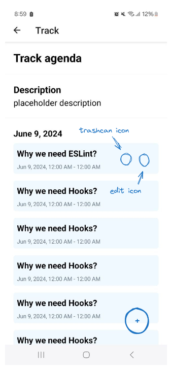

## Set up project

Clone the project

```
git clone https://github.com/neiios/dam-project-client.git
```

Install dependencies

```
npm install
```

Create .env file in root directory and add the IP address and port your dev API is running on

```
EXPO_PUBLIC_API_BASE=192.168.2.233:8080
```

Start project

```
npm run start
```

Then scan QR code with Expo app. Make sure that your devices are on the same network.
Also make sure that the ports are open in your firewall.

## TO-DO

### Conferences

1. [ ] Contact/ Request info about article
2. [ ] Q&A for articles

### Profile

1. [ ] See user info on profile page
2. [ ] Log out
3. [ ] Switch theme

### Auth

1. [ ] Sign in
2. [ ] Sign up
3. [ ] Auto-logout (JWT expiration)
4. [ ] State of the app for guest users
5. [ ] State of the app for admin users

### Backoffice

Maybe it's worth adding edit/remove buttons to the pages and not list items tho


### Secondary stuff

1. [ ] Infinite scroll for conferences
2. [ ] Animation on touch of nav items (filling background color)
3. [ ] Find an adequate way of nesting routes, with something like [id].tsx
   - https://github.com/huanghanzhilian/c-shopping-rn/tree/main/app
   - https://docs.expo.dev/develop/dynamic-routes/
4. [ ] Fallback img for conferences
5. [ ] Add share button to header of a conference page (probably need context for state)
